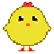

<h2>Información</h2>

Curso: Diplomado nivel básico en el desarrollo de videojuegos - Grupo 1

Profesor: Wilmar Arcila Castaño

Integrantes: Angie Vanesa Polanco Sierra - Juan Sebastián Segura Pinzón - Jose Santiago Giraldo Sanchez

<h2>PROYECTO:</h2>

Desarrollo de un video juego basico

<h2>TITULO: POLLITOS EN FUGA</h2>

<!-- Referencias para las imagenes -->
[Level1]: /public/images/splash.png "Imagen del splash"

<h2>GENERO DEL JUEVO:</h2>

 Plataformero 

<h2>PERSPECTIVA:</h2>

Tercera Persona 2D

<h2>MODO DE JUEGO:</h2>

Single Player

<h2>AUDIENCIA OBJETIVO: </h2>

- Edades +3 años

- Fans de los juegos de plataforma retro

<h2>IDEA CENTRAL:</h2>

Es un juego de plataformas que consta con 3 niveles en los cuales el jugador debe ir superando cada nivel evitando los enemigos de cada nivel para ir avanzando en la historia

<h2>OBJETIVO DEL JUEGO:</h2>

El jugador debe avanzar en la historia completando los niveles para lograr que su personaje pueda volver al gallinero

<h2>TOPICO DEL JUEGO:</h2>

Juego de Plataforma Heróico

<h2>PLATAFORMAS DISPONIBLES:</h2>

PC (Win 10)

<h2>Sección 2 - Background & Flujo del juego</h2>

1. Contexto:
 

El juego se desarrolla en la granja de la familia pereza en el granero donde se encontraban todas las gallinas con sus pollitos
En este granero se encontraban bastantes animales que la familia pereza había criado desde hace bastantes años 
incluyendo nuestro personaje que era un pollito llamado LITTLE
Litle se encontraba en la ventana con su madre y sus hermanos apreciando el amanecer 
cuando de repente apareció el gato de la familia queriendo llamado SPOCK 
todas las gallinas intentaron escapar de él con sus pollito 
algunos lo lograron otros fueron víctimas de SPOCK 
spock pudo observar a la familia de little en la ventana y fue tras ellos la mamá gallina pudo escapar con todos sus hijos excepto litle, este cayó en la ventana y spock fue tras de él
la misión de little es volver al granero con su familia pero spock no se lo pondrá fácil ni nadie que se encuentre en su camino
 
<h2>2. Historia del personaje:</h2> 

LITLE:
 

<!-- Referencias para las imagenes -->
[Level1]: /public/images/Pollito_60x60.gif "Imagen del pollito"

Este es nuestro personaje principal
Es un pollito de la granja que tiene la familia pereza
Su misión es volver al granero con su familia
Y evitar a sus enemigos en el camino
 
<h2>3. Historia de los enemigos:</h2>  

SPOCK

<!-- Referencias para las imagenes -->
[Level1]: /public/images/Gato.gif "Imagen del gato"

Es el enemigo principal en la dificultad normal
Su objetivo es perseguir a little hasta conseguir que sea su cena

EAGLE

<!-- Referencias para las imagenes -->
[Level1]: /public/images/agila.png "Imagen del agila"

Es el enemigo principal de la dificultad profesional
Su objetivo es devorar a little y destruir sus plataformas

<h2>4. Desarrollo de la historia:</h2>   

Cada ves que litle  avanza un nivel más
Se va acercando al camino de regreso a la granja para encontrarse con su familia

<h2>Sección 3 - Juego</h2>
<h2>1. Objectivo(s):</h2>

- objetivo 1

- objetivo 2

- etc

<h2>2. Reglas del juego:</h2>

- Regla 1 del juego

- Regla 2 del juego

- etc

<h2>3. Mecánica del juego:</h2>
  
- Movimientos del personaje
izquierda, derecha , arriba y caída

 
- Movimientos de los enemigos
perseguir al personaje principal

  
  
- Obstáculos y trampas
los obstáculos caen del cielo

<!-- Referencias para las imagenes -->
[Level1]: /public/images/roca.png "Imagen de la roca"

<!-- Referencias para las imagenes -->
[Level1]: /public/images/rama.png "Imagen de la rama"

<h2>4. Completar con varios o todos de los siguientes (a necesidad)</h2>
<h2>• Game options</h2>

pausa

nuevo juego

creditos

<h2>• Modes</h2>

dificultad normal

dificultad profesional

<h2>• Game levels</h2>

3 escenarios

<!-- Referencias para las imagenes -->
[Level1]: /public/images/escenario1.PNG "Imagen del escenario"

<!-- Referencias para las imagenes -->
[Level1]: /public/images/escenario2.PNG "Imagen del escenario"

<!-- Referencias para las imagenes -->
[Level1]: /public/images/escenario3.PNG "Imagen del escenarioh"

<h2>• Player’s controls</h2>

flecha izquierda: movimiento hacia la izquierda

flecha a la derecha: movimiento a la derecha

barra espaciadora: saltar

mousa: seleccionar opciones del menu

<h2>• Winning</h2>

obtiene puntaje por cada mazorca obtenida

<h2>• Losing</h2>

por caer al precipicio pierde 1 vida y los puntos

<h2>• End</h2>

si el personaje pierde las 3 vidas tendrá un final triste
si el personaje gana tendrá un final feliz

<h2>Section 4 – Game Elements</h2>
<h2>1. Environment:</h2>
<h2>ESCENARIO 1: contiene</h2> 

-precipicios

-plataformas elevadas
 

-obstáculos en formas de rama

-enemigo principal es el gato SPOCK

-contiene mazorcas para aumentar el puntaje

-el escenario se caracteriza por tener un clima cálido con un cielo azul y bastantes nubes

<h2>ESCENARIO 2: contiene</h2>

-se caracteriza por tener un clima opaco de noche

- el villano principal es el gato y en este ya se puede observar que el gato lo esta persiguiendo a nuestro personaje
 

- contiene bastantes precipicios

- los obstáculos son piedras que caen del cielo

- plataformas elevadas

- contiene mazorcas que le aumentan el puntaje

- se encuentran gusanos los cuales restan puntaje

<h2>ESCENARIO 3: contiene</h2>

- el escenario se caracteriza por tener un clima cálido con un cielo azul y bastantes nubes

- tiene plataformas inclinadas

- contiene obstáculos que son piedras 

- Los enemigos de este escenario son el gato SPOCK y la aguila EAGLE

-contiene gusanos que restan puntaje 

- contiene mazorcas que le aumentan el puntajev

<h2>2. Personajes:</h2>  
  <h2> 2.1 Personajes Jugadores:

 el personaje principal es el pollito LITLE

      

- Enumerar y hacer una breve descripción de los personajes jugadores del juego  
Es un pollito de 15 cm de color amarillo un poco grueso y muy habil para saltar

   <h2>2.2 Personajes NO Jugadores:</h2>

el gato SPOCK

la aguila EAGLE

el gusano

  
<h2> - Enumerar y hacer una breve descripción de los personajes NO jugadores del juego</h2>  

1 el gato SPOCK: es un gato de color amarillo con blanco tiene un tamaño de 25 cm es muy rapidoy siempre tiene hambre

2 la aguila EAGLE: es un aguila de color cafe es de un tamaño de 40cm  con alas grandes y con unas garras largas y le encantan las presas pequeñas

3 el gusano: en un gusano de color rosa de 10cm que se mueve de izquierda a derecha y le encanta robar los puntos del jugador

3. Armas o elementos colectables:  
MONEDAS: es de un tamaño 4cm con un color amarillo y cuando se recolectasirve para cambiar de escenario

MAZORCAS: es de un tamaño de 5cm con un color amarillo con verde y se utiliza para obtener puntaje en los escenarios

